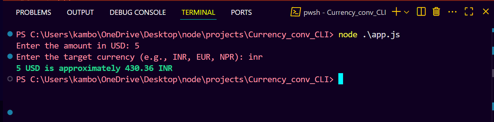
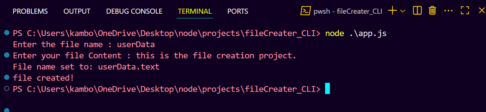
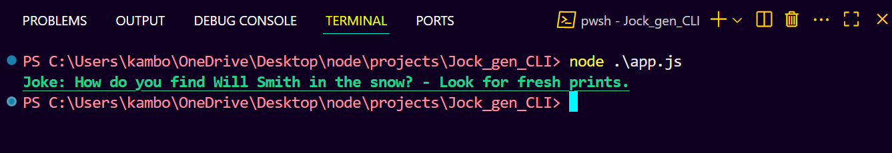
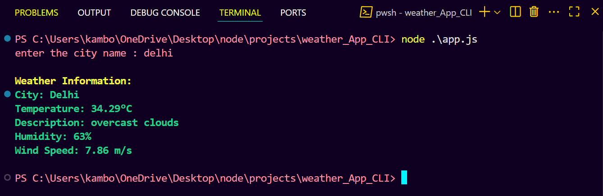

# 🚀 Backend with Node.js – Learning Repository

This repository is a comprehensive collection of Node.js learning modules and CLI projects created by Nikhil Kamboj. It is designed to help understand core Node.js concepts, module systems, and build practical CLI applications step-by-step.

---

## 📖 Table of Contents

- [🌟 Project Overview](#-project-overview)
- [🛠 Tech Stack](#-tech-stack)
- [📂 Repository Structure](#-repository-structure)
- [⚡ Getting Started](#-getting-started)
- [📸 Demo Screenshots](#-demo-screenshots)
- [📦 Dependencies](#-dependencies)
- [✍️ Author](#-author)
- [📄 License](#-license)
- [🔗 Repository Link](#-repository-link)

---

## 🌟 Project Overview

This project is structured into two main parts:

- **Modules:** Demonstrations and examples of core Node.js modules and module systems.
- **Projects:** Practical CLI applications built using Node.js.

This repo is ideal for anyone looking to learn Node.js fundamentals and explore how to build real-world command-line tools.

---

## 🛠 Tech Stack

- 🟢 Node.js
- 📦 NPM (for package management)
- 💻 JavaScript (ES6+)
- 🎨 Chalk for terminal string styling

---

## 📂 Repository Structure

### 📦 Modules

The `modules/` directory contains subfolders demonstrating different Node.js module systems and core modules:

- **commonjs/** 📄 Demonstrates the CommonJS module system using `require` and `module.exports`.  
  ➡️ Example: Basic math operations (add, subtract, multiply, divide).

- **ES_module/** 📄 Demonstrates ES Modules using `import` and `export`.  
  ➡️ Example: Similar math operations using ES module syntax.

- **event_module/** 📄 Examples using Node.js EventEmitter for event-driven programming.

- **fs_module/** 📄 Demonstrates various ways to work with the file system, including synchronous, asynchronous, promises, and async/await styles.

- **http_module/** 📄 Example of creating a basic HTTP server using Node.js core `http` module.

- **os_module/** 📄 Examples demonstrating usage of Node.js `os` module to get system information.

- **path_module/** 📄 Examples demonstrating usage of Node.js `path` module for file and directory path manipulations.

---

### 📦 Projects

The `projects/` directory contains several CLI applications built with Node.js:

- **Currency_conv_CLI/** 💱 Command-line currency converter application.

- **fileCreator_CLI/** 📁 CLI tool to create files programmatically.

- **Joke_gen_CLI/** 😂 CLI application to generate jokes.

- **todo_CLI/** ✅ A simple command-line todo list application to add and view tasks.

- **weather_App_CLI/** ☁️ CLI tool to fetch and display weather information.

---

## ⚡ Getting Started

### 🔥 Prerequisites

Node.js installed on your system (v14+ recommended).

### 🛠 Installation

Clone the repository:

```bash
git clone https://github.com/nikhil-kamboj420/Backend-with-Node.js-by-Nikhil.git
cd Backend-with-Node.js-by-Nikhil
```

Install dependencies (if any):

```bash
npm install
```

### ▶️ Running CLI Projects

Navigate to the desired project folder and run the app:

```bash
cd projects/todo_CLI
node app.js
```

Replace `todo_CLI` with any other project folder name to run different CLI apps.

---

## 📸 Demo Screenshots

Here’s how some CLI apps look in action:

💱 Currency Converter CLI App

📁 File Creator CLI App

😂 Joke Generator CLI App

✅ Todo CLI App

🌦️ Weather CLI App


---

## 📦 Dependencies

- chalk: Used for terminal string styling.

---

## ✍️ Author

👤 Nikhil Kamboj

🌐 GitHub: [nikhil-kamboj420](https://github.com/nikhil-kamboj420)

📧 Email: kambojnikhil44@gmail.com

🔗 Portfolio: [nikhil-kamboj-portfolio.netlify.app](https://nikhil-kamboj-portfolio.netlify.app)

---

## 📄 License

This project is licensed under the ISC License.

---

## 🔗 Repository Link

[Backend with Node.js by Nikhil](https://github.com/nikhil-kamboj420/Backend-with-Node.js-by-Nikhil)
